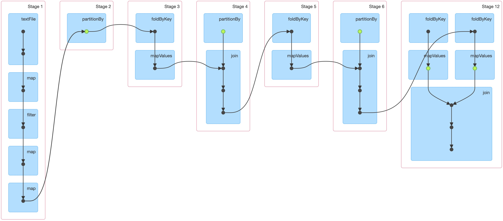

# Real Time Human Activity Classification from IMU data on Spark
The project is the implementation in **Scala + Spark** of a **Multilabel Classifier** of human activity from smartphones IMU sensor data.

The work is split in two main Apps:

- **TrainingApp** fits the chosen model - DT or MLP - to supervised data.

- **StreamingApp** reads input data on TCP socket and classifies on the fly on a sliding window.

They both run in local or cloud mode via bash scripts, provided the spark installation directory:

`script/run_local_training.sh /path/to/spark`

 or **AWS Elastic Map Reduce** IAAS, see below.

`script/run_emr_training.sh /path/to/spark`

Our best MLP model achieves **96%** and more accuracy on unseen data.

___
### 1. The Data

The dataset is mantained by the UC Irvine Machine Learning Center here: http://archive.ics.uci.edu/ml/datasets/Heterogeneity+Activity+Recognition


> The Heterogeneity Human Activity Recognition (HHAR) dataset >from Smartphones and Smartwatches is devised to benchmark >human activity recognition algorithms in real-world contexts; specifically, it is gathered with a variety of different device models and use-scenarios, in order to reflect sensing heterogeneities to be expected in real deployments.


Around 13 million phone's accelerometer and gyroscope entries are provided, each with its millisecond-precision record time and labelled activity, which we use.

Activities: ‘Biking’, ‘Sitting’, ‘Standing’, ‘Walking’, ‘Stair Up’ and ‘Stair down’.

Sensors: Two embedded sensors, i.e., Accelerometer and Gyroscope, sampled at the highest frequency the respective device allows.

Devices: 8 smartphones (2 Samsung Galaxy S3 mini, 2 Samsung Galaxy S3, 2 LG Nexus 4, 2 Samsung Galaxy S+)

Recordings: 9 users 

Presented like this:

```
Index,Arrival_Time,Creation_Time,x,y,z,User,Model,Device,gt
0,1424696633908,1424696631913248572,-5.958191,0.6880646,8.135345,a,nexus4,nexus4_1,stand
1,1424696633909,1424696631918283972,-5.95224,0.6702118,8.136536,a,nexus4,nexus4_1,stand
2,1424696633918,1424696631923288855,-5.9950867,0.6535491999999999,8.204376,a,nexus4,nexus4_1,stand
.
.
```
___
### 2. Time series Classification

To extract valuable features a window approach is used:
the dataset is grouped in 10 seconds windows.
5 statistics are then computed for each sensor axis and window:

- Mean 
- Variance 
- Covariance
- Skewness (measures distribution asymmetry)
- Kurtosis  (measures outliers)

The latter 2 standard moments measure distribution asymmetry (skew), and tail relevance (kurtosis).
The introduction of these alone raises accuracy from 93% to 96% approx.

A total of 5 feature x 3 axis x 2 sensors gives 30 unique features for the classification task.


___
### 3. Preprocessing

- SparkSql as state of the art:

SparkSql implements means, variances and covariances computations with optimality.
This state of the art is used as reference for our spark-core only implementation.

- Spark Core
The Preprocessing Spark Job pipeline for the accelerations input file is shown,
stages 1-6 are replicated for the gyroscope data, 
the two are then joint in stage 12.



- `PartitionBy` key and `persist` are done for improving performance of join and key based operations.


___
### 4. Training with mllib pipeline

Spark pipeline is used to train the model, stages are:
1. label indexer: converts activity labels to indices
2. min-max scaler,
3. classifier, 
4. label converter: reverts labels back from indices

Multi-layer perceptron and decision tree algorithms are implemented,
with MLP achieving the best result.

___
### 5. SparkStreaming

To classify data in real time, input stream is batched by Spark windows of length 10 seconds,
a sliding window of this size is computed every 5s for smoother response.


`DStream` time series input is processed to output predictions, available as `DStream` too.

___
### 6. AWS deployment

- benchmarks same app with more workers
___
### 7. Overcome challenges

- collections operations optimization (GC, groupby vs reducebykey)
- code refactoring
- local vs cloud deploy